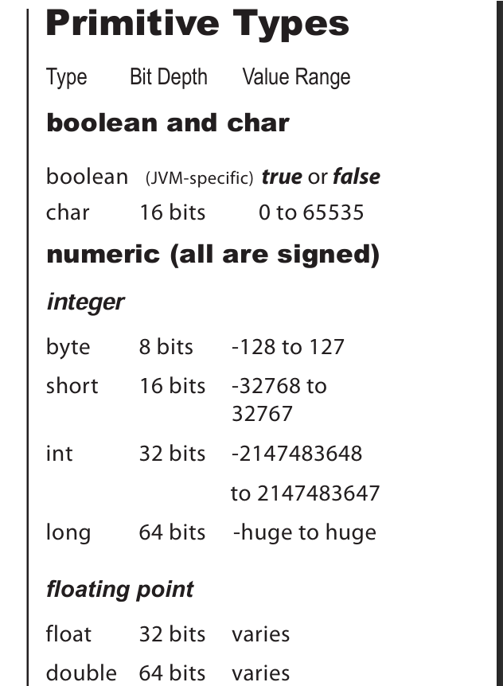
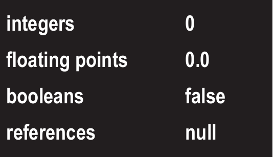
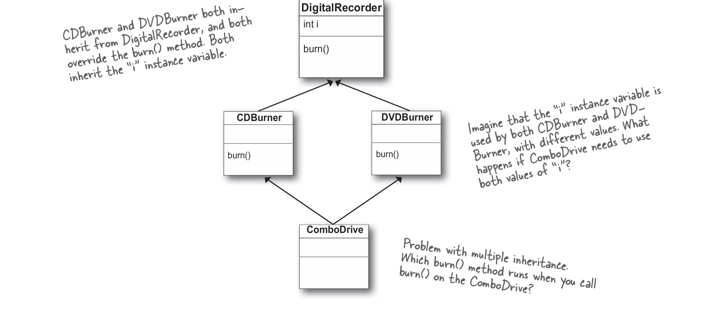
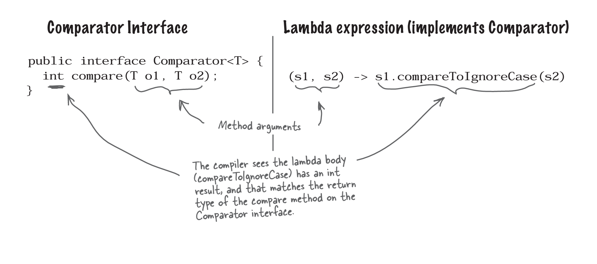
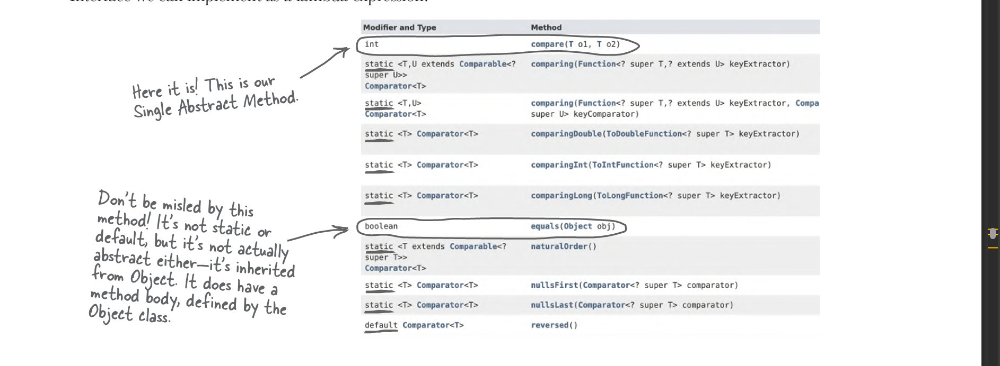
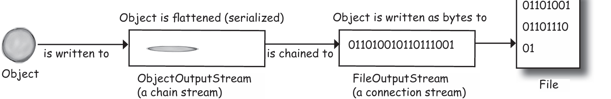
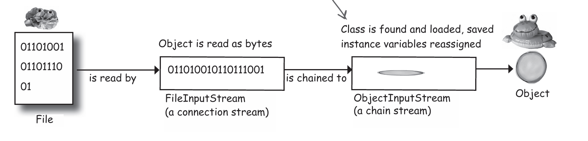
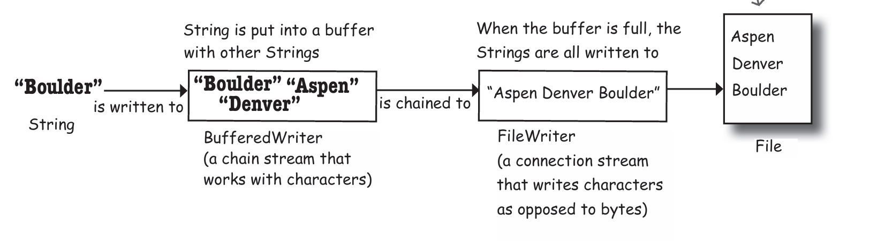

# Java Journal
 oK. tHIS IS me learning java and making sure I get the fundamentals right this time. How can be I sure that I can do that this time. IDK, we will see whether it works.
 I am preapring this journal to easily refresh whenever I want to. 
 Starting with  the Book -  Head First Java 3rd Edition

polama...

> * A Java program is a pile 
of classes (or at least one class). 
> * There isn’t a concept of 
“global” variables and methods 
in a Java OO program.
> * Marking 
a method as public and 
static makes it behave much 
like a “global.” Any code, in any 
class of your application, can 
access a public static method. 
And if you mark a variable as 
public, static, and final, 
you have essentially made a 
globally available constant. 

                Source Code 
                .java 
                    |
                    | Compiler 
                    |   javac
                    |
                    V
                bytecodes
                .class
                    |
                    |  JVM
                    |
                    V
                Output
 
> Java is famous for its backward compatibility, so old code can run quite happily on new JVMs.  Java was initially released (some would say “escaped”), on January 23, 1996.

<b> The naming conventions for Java’s versions are 
confusing. There was JDK 1.0, and 1.2, 1.3, 1.4, then a jump 
to J2SE 5.0, then it changed to Java 6, Java 7 <br/><br/>
 <i>
    Technically Java SE 5.0 was actually Java 1.5. Same for 6 
    (1.6), 7 (1.7), and 8 (1.8). In theory, Java is still on version 
    1.x because new versions are backward compatible, all the 
    way back to 1.0. 

    However, it was a bit confusing having a version number 
    that was different to the name everyone used, so the 
    official version number from Java 9 onward is just the 
    number, without the “1” prefix; i.e., Java 9 really is version 
    9, not version 1.9. 

 </i></b>

  Running a program means telling the Java Virtual Machine (JVM) to “Load the 
MyFirstApp class, then start executing its main() method. Keep running 
’til all the code in main is finished.”

Java is an object-oriented 
(OO) language. It’s not like the 
old days when you had steam
driven compilers and wrote one 
monolithic source file with a pile 
of procedures

 When you design a class, think about the objects that 
will be created from that class type. Think about:
 * things the object knows  - instance variables
 * things the object does   - methodsś

 > * ### A class is a blueprint for an object.

## Variables can store two types of things: primitives and references. 

* A variable is just a cup. A container. It holds something.

* Variables come in two flavors: primitive and object reference.

* Primitive variables stores the bit pattern of fixed size as declared data type.
* The compiler won’t let you put a value from a big data type variable into small data type variable. 



 
* An object reference variable holds bits that represent a 
way to access an object.It doesn’t hold the object itself, but it holds something like a pointer. Or an address. Except, in Java we don’t 
really know what is inside a reference variable. We do 
know that whatever it is, it represents one and only one 
object. And the JVM knows how to use the reference to 
get to the object. The actual object is stored in the Heap and not in the variable itself.

* Arithmetic operations cannot be perfomed on refrence variables.
* All references for a given JVM will be the same size regardless of the objects they reference.
* Whenever a Object is abandoned , it is eligible for garbage collection.

*  Only instance variables get a default value.
*  Local variables , which are inside the methods needs to intialized, otherwise the compiler throws an error.



> obj.bark() - it is called a caller , the values passed in these functions are called arguments.
### Java is pass-by-value
 The copy of the arguments are only sent to the intended method due to this there will no effect to the varaible passed in the caller.
 As the value passed by object reference varaible is a refrence to the actual object. Chnages made will affect the reference obj naturally.

## Encapsulation
 Without using access modifiers , accessors (getters) and mutators (setters) in the class variables and methods, the objects are by default public. 
 
 What does public mean here ? anyone can do this to a object.
 theCat.height = 0; 

 Suppose if we want to restrict the height of cat from getting negative values.
 it is impossible to control the usage of the instance varaibles now.
 Thats why as a rule of thumb,  always mark the instance varaibles private and
 create a getter and setter method for each instance variable . And mark these methods public.

 Now if someone wants to change the height value of an object can only use the setter method.

## How to execute a java prgm via cmdline

> ### Compile the independent classes  using  javac Name.java
> ### Compile the dependant classes by mentioning the classpath directory or jar file javac -cp dir Name.java
> ### Run the prgm by mentioning the classpath java -cp dir name

## how come I never had to import the String class? Or System?
 the java.lang package sort of “pre-imported” 

## Inheritance
*  When you design with inheritance, you put common code in a 
class and then tell other more specific classes that the common 
(more abstract) class is their superclass. When one class inherits 
from another, the subclass inherits from the superclass.

* subclass can add new methods and instance variables of its 
own, and it can override the methods it inherits from the 
superclass

* When you want to know if one thing should extend another, apply the IS-A test. 
 > * Triangle IS-A Shape, yeah, that works.
 > * Cat IS-A Feline, that works too.
 > * Surgeon IS-A Doctor, still good.
 > * Tub extends Bathroom, sounds reasonable.  Until you apply the IS-A test. 

* In a subclass, what if I want to use BOTH the superclass version and my overriding subclass version of a method?  In other words,  I don’t want to completely replace the superclass version; I just want to add more stuff to it.
``` 
public void roam() {
   super.roam();
    // my own roam stuff
 } 
```
* Access levels control who sees what

 > *  public members are inherited
 > *  private members are not inherited

* Because of inheritance , you can establish a contract and polymorphism.
and no duplicate code.

## Polymorphism - Many Forms
*  the ability to use a superclass type (often abstract) as a method argument, return type, or array type. 
*  With polymorphism, the reference type and the object type can be different.
```
Animal myDog = new Dog();
```
* This lets you do things like make polymorphic arrays.
```
 Animal[] animals = new Animal[5];
 animals[0] = new Dog();
 animals[1] = new Cat();
 animals[2] = new Wolf();
 animals[3] = new Hippo();
 animals[4] = new Lion();
 
 for (Animal animal : animals) {
  animal.eat();
  animal.roam();
 }

```
* can have polymorphic arguments and return types.
```
class Vet {
  public void giveShot(Animal a) {
    a.makeNoise();
  }
 }

 class PetOwner {
  public void start() {
    Vet vet = new Vet();
    Dog dog = new Dog();
    Hippo hippo = new Hippo();
    vet.giveShot(dog)
    vet.giveShot(hippo);
  }
 }
 
 ```

> * There’s no such thing as a private class , except in a special case called inner class
> *  A non-public class can be subclassed only by classes in 
the same package as the class. Classes in a different package won’t be able to subclass 
> * A final class means that it’s the end of the inheritance line. Nobody, ever, can extend a final class.
> *  if a class has only private constructors it can’t be subclassed.
> * Typically, you won’t make your classes final. But if you need security—the security of knowing that the methods will always work the way that you wrote them (because they can’t be overridden),  a final class will give you that. A lot of classes in the Java API are final for that reason. The String class, for example, is final
> * If you want to protect a specific method from being overridden, mark the method with the final modifier. Mark the whole class as final if you want to guarantee that none of the methods in that class will ever be overridden.

*  When you override a method from a superclass, you’re agreeing to fulfill the contract. 

 > 1. Arguments must be the same, and return types must be compatible.
 > 2. The method can’t be less accessible.

> <b><i>An overloaded method is just a different method that happens to have the same method name. It has nothing to do with inheritance and polymorphism. An overloaded method is NOT the same as an overridden method.<i></b>

## Serious Polymorphism
* Abstract classes , where the classes cannot be instantiated. We need this, when the superclass solepurpose is to facilitate inheritance and polymorphism. For example, the Animal class needs to an abstract class.
```
abstract class Animal {

   public abstract void makeRoam();

   public void eat(){
    // eating
   }
}
```
* A class thats not abstract is called concrete class
* Abstract methods can be only part of abstract class
* Abstract classes can have both abstract and non-abstract methods
```
 Animal[] animals = new Animals[5]; // this is allowed
 Animal animal = new Animal(); // error
 ```
* Object class is the superclass for everything
* Any class that doesn’t explicitly extend another class, implicitly extends Object.
* Object class is not abstract
```
 Object o = new Ferrari();
 o.goFast(); //Not legal! , call a method on an object reference only if the class of the reference type actually has the method.
```
* ### The compiler decides whether you can call a method based on the reference type, not the actual object type

* Multiple inheritance causes the problem of DDD (Deadly Diamond of Death)


This is why Java doesn't support multiple inheritance of classes. 

* In order to support multiple inheritance and avoid the problem of DDD, interface is built in Java. All the members of the variables are by default public , static and final and all the methods are abstract  implicitly.
And non-abstract methods is not possible.

```
public interface Pet {

    void beFriendly();
    void play();
}

public class Dog extends Canine implements Pet {

    public void beFriendly(){
        .....
    }
    public void play(){
        ....
    }

    public void roam(){
        .....
    }
    public void eat(){
        .....
    }
}
```
* A class that implements an interface must implement all the methods of the interface , except the default and static methods.


## Object Lifecycle
* Local variables and method call lives in the stack
* Instance variable lives in the heap memory
*  The method on the top of the stack is always the currently executing method.
* Java has two areas of memory we care about: the Stack and the Heap.
* Instance variables are variables declared inside a class but outside any method.
* Local variables are variables declared inside a method or method parameter. 
* All local variables live on the stack, in the frame corresponding to the method where the variables are declared.
* Object reference variables work just like primitive variables—if the reference is declared as a local variable, it goes on the stack.
* All objects live in the heap, regardless of whether the reference is a local or instance variable.

* A constructor has the code that runs when you instantiate an object. In other words, the code that runs when you say new on a class type. Every class you write has a constructor, even if you don’t write it yourself.
```
// the compiler’s default constructor looks like: 
 public  Duck() {
 }
 ```
 <i>Methods must have a return type, but constructors cannot have a return type. The compiler will allow these methods but don’t do this. It’s against normal naming conventions (methods start with a lower case letter) but more importantly it’s super confusing.
 
  ```
   public void Duck() {
 }
  ```
 </i>

* Constructors are not inherited.
* Overloaded constructors means you have more than one constructor in your class. 
*  If you write a constructor that takes arguments and you still want a no-arg constructor, you’ll have to build the no-arg constructor yourself.
* Constructors can be public, pro tected, private, or default
*  All the constructors in an object’s inheritance tree must run when you make a new object. 
* When a constructor runs, it immediately calls its superclass constructor, all the way up the chain until you get to the class Object constructor. 
* The only way to call a superclass constructor is by calling super(). 
*  The call to super() must be the first statement in each constructor!
*  Use this() to call an overloaded constructor from another construstor.
* Every constructor can have a call to super() or this(), but never both!
*  An object’s life depends entirely on the life of references referring to it. If the reference is considered “alive,” the object is still alive on the Heap. If the reference dies (and we’ll look at what that means in just a moment), the object will die.
* object’s life depends on the reference variable’s life
* A local variable is alive as long as its Stack frame is on the Stack. In other words, until the method completes
* A local variable is in scope only within the method in which the variable was declared. When its own method calls another, the vari able is alive, but not in scope until its method resumes. You can use a variable only when it is in scope.
*  An object becomes eligible for GC garbage collection when its last live reference disappears ,  assigned the reference to another object and explicitly set the reference to null.

## static and final
* There is no global anything in java.
* Methods that doesn't use the instance variables can be static.
* The keyword static lets a method run without any instance of the class.
* Call a static method using a class name
```
 Math.min(2,5);
 ```
* static methods can't use instance variables and non-static methods.
* static variables are shared, all the instance of the same class share a single copy of the static variables.
* Static variables in a class are initialized before any object of that 
class can be created.
* Static variables in a class are initialized before any static method 
of the class runs.
* static variables get default values just like instance variables.
* A static method should be called using the class name rather than an object reference variable
* static final variables are constant.
```
public static final double PI = 3.141592653589793;
```

A static initializer is a block of code that runs when a class is loaded, before any other code can use the class, so it’s a great place to initialize a static final variable. 
```
class ConstantInit1 {
    final static int X;
 
    static {
      X = 42;
    }
    
}
```
 A	final	static	variable	must	be	assigned	a	value	either	
at the time it is declared or in a static initializer

* A	final	variable	value	cannot	be	changed	once	it	has been assigned.
* Assigning	a	value	to	a	final	instance variable must be either at the time it is declared or in the constructor.

* final variable means you can't change its value.
* final method means you can't override the method.
* final class means you can't extend the class.

```
class Foof {
 
 final int size = 3;
 
 final int whuffie;
  Foof() {
    whuffie = 42;  // now you can’t change whuffie
  }

  void doStuff(final int x) {
    // you can’t change x
  }
  void doMore() {
    final int z = 7;
    // you can’t change z
  }
 }

```
If you need to count on a particular implementation of the methods in a class, make the class final

## Wrapper and autoboxing
* A wrapper is used when you want to treat a primitive like an object.
* There’s a wrapper class for every primitive type, and since the wrapper classes are in the java.lang package, you don’t need to import them. 
```
// wrapping a value
 int i = 28;
 Integer iWrap = new Integer(i);

// unwrapping
int unwrapped = iwrap.intValue();
```
* In The Olden Days (pre–Java 5), we did have to do all this ourselves, manually wrapping and unwrapping primitives. Fortunately, now it’s all done for us automatically.
```
public void autoboxing() {
 
  int x = 32;
  ArrayList<Integer> list = new ArrayList<Integer>();
  list.add(x);
  int num = list.get(0); 
 }
```
the compiler automatically unwraps (unboxes) the Integer object so you can assign the int value directly to a primitive without having to call the intValue() method on the Integer object

* Autoboxing works everywhere
  1. Method arguments
    ```
    void takeNumber(Integer i) { }

    ```
  2. Return Values
    ```
        int giveNumber() { 
        return x;
        }

    ```
  3. Boolean Expression
    ```
        if (bool) {
        System.out.println("true");
        }

    ```
  4. Operations on numbers
    ```
    Integer i = new Integer(42); 
    i++;
    Integer j = new Integer(5); 
    Integer k = j + 3;
    ```
  5. Assignments
    ```
    Integer intVal = x;
    x = intVal
    ```
* Convert a string to primitive value using the parse method of wrapper class.
```
 String s = "2";
 int x = Integer.parseInt(s);
 double d = Double.parseDouble("420.24");
 boolean b = Boolean.parseBoolean("True");


 // NumberFormatException
 String t = "two";
 int y = Integer.parseInt(t);

```

* Primitive value to string use the following
```
    double d = 42.5;
    String doubleString = "" + d;

    double d = 42.5;
    String doubleString = Double.toString(d);


    double d = 42.5;
    String doubleString = String.valueOf(d);

```
## Formatting
* Can make big numbers readable
```
 long hardToRead = 1000000000;
 long easierToRead = 1_000_000_000;
 long legalButSilly = 10_0000_0000;

```
* Use the format method in String class

```
 public class TestFormats {
  public static void main(String[] args) {
    long myBillion = 1_000_000_000;

    String s = String.format("%,d", myBillion);

    System.out.println(s);
  }
 }

 // output 
 // 1,000,000,000

```
1. %,d  means “insert commas and format the number as a decimal integer.”
2. %.2f means “format the number as a floating point with a precision of two decimal places.”
3. %,.2f  means “insert commas and format the number as a floating point with a precision of two decimal places.”

* A format specifier can have up to five different parts (not including the “%”). Everything in brackets [ ] below is optional, so only the percent (%) and the type are required. But the order is also mandatory, so any parts you DO use must go in this order

```
% [argument number] [flags] [width] [.precision] type

format("%,6.1f", 42.000);
// argument number is missing
// , is the flag
// 6 is the width
// .1 is the precision
// f is the type
```

* What are the different values for type
1. %d - decimal
   - The argument must be compatible with an int, so that means only byte,  short, int, and char (or their wrapper types).
    ```
    String.format("%d",42); // 42
    String.format("%d",34.23) // illegal , it is same as trying to  
                              // assign a double value to an int  
                              // variable.
    ```
2. %f - floating point
    - The argument must be of a floating-point type, so that means only a float or double (primitive or wrapper) as well as something three zeros. called BigDecimal 
    ```
    String.format("%.3f",23.00000); // 23.000 
    ```
3. %x - hexadecimal
    - The argument must be a byte, short, int, long (including both 
    primitive and wrapper types), and BigInteger. 
    ```
    String.format("%x",42); // 2a
    ```
4. %c - character
    -  The argument must be a byte, short, char, or int (including both primitive and wrapper types).
    ```
    String.format("%c",42); // *
    ```
* Variable argument feature is used in the format method.

* static imports
```
    import static java.lang.Math.*;
    import static java.lang.System.out;

    class WithStatic {

        public static void main(String[] args) {

        out.println("sqrt " + sqrt(2.0));
        out.println("tan " + tan(60));
        }

    }

```
## Datastructures and Collections
* This syntax is called the diamond operator and was introduced in Java 7
* The compiler can tell from what you wrote on the left-hand side what you probably want on the right-hand side. It uses type inference to infer (work out) the type you need
```
 ArrayList<String> songs = new ArrayList<>();
```
* collection classes in the java.util package
* Collections.sort() 
    - Sorts	the	specified	list	into	ascending	order,	according	to	the	natural ordering of its elements.
    -  Java uses Unicode based sorting here , and that means that numbers sort before uppercase letters, uppercase letters sort before lowercase letters, and some special characters sort before numbers and some sort after numbers. 
* the sort() method makes heavy use of generics. Any time you see something with angle brackets in Java source code or documentation, it means generics—a feature added in Java 5
*  use generics to write type-safe collections , type-safe collections where more problems are caught at compile-time instead of runtime
* A generic class means that the class declaration includes a type parameter. 
```
public class ArrayList<E> extends AbstractList<E> {  
public boolean add(E o)
}
```
* A generic method means that the method declaration uses a type parameter in its signature. (before the return type)
```
public <T extends Animal> void takeThing(ArrayList<T> list)
```
* \<Animal\> violates polymorphism.
*  In generics, “extends” means “extends or implements”
```
 public static <T extends Comparable<? super T>> void sort(List<T> list)
 // T must be of a type that implements the  Comparable interface
```
*  A Comparable element in a list can compare itself to another of its own type in only one way, using its compareTo() method.
* a Comparator is external to the element type you’re comparing—it’s a separate class

* Invoking the Collections.sort(List list) method means the list element’s compareTo() method determines the order. The elements in the list MUST implement the Comparable interface.
*  Invoking List.sort(Comparator c) or Collections.sort(List list, Comparator c) means the Comparator’s compare() method will be used. That means the elements in the list do NOT need to implement the Comparable interface, but if they do, the list element’s compareTo() method will NOT be called.

> <i> List.sort was introduced in Java 8</i>

Checkout the comparable and comparator example [here](./pgm/collections_test/Jukebox.java)
```
class ArtistCompare implements Comparator<SongV3> {
  public int compare(SongV3 one, SongV3 two) {
    return one.getArtist().compareTo(two.getArtist());
  }
 }
```
* The comparator implemented class can be also written using lambda expression.
```
songList.sort((one, two) -> one.getTitle().compareTo(two.getTitle()));
```
* With interfaces like Comparator, we only have to implement a single abstract method, SAM for short. These interfaces are so important that they have several special names

* SAM Interfaces  a.k.a.  Functional Interfaces

* If an interface has only one method that needs to be implemented, that 
interface can be implemented as a lambda expression. 

* From the Collection API, we find three main interfaces, List, Set, and Map. ArrayList is a List, but it looks like Set is exactly what we need.
Map interface doesn’t actually extend the Collection interface, but Map is still considered part of the “Collection Framework”

  1. LIST - when sequence matters
      - Collections that know about index position.
      - Lists know where something is in the list. You can have more than one element referencing the same object.

  2. SET - when uniqueness matters
      -  Collections that do not allow duplicates. Sets know whether something is already in the collection. You can never have more than one element referencing the same object (or more than one element referencing two objects that are considered equal—we’ll look at what object equality means in a moment).

  3. MAP - when finding something by key matters
      - Collections that use key-value pairs. Maps know the value associated with a given key. You can have two keys that reference the same value, but you cannot have duplicate keys. A key can be any object.
* If two objects foo and bar are equal, foo.equals(bar) and bar.equals(foo) must be true, and both foo and bar must re turn the same value from hashCode(). For a Set to treat two objects as duplicates, you must override the hashCode() and equals() methods inherited from class Object so that you can make two different objects be viewed as equal.
  - Reference Equality
  - Object Equality
```
 public boolean equals(Object aSong) {
    SongV4 other = (SongV4) aSong;
    return title.equals(other.getTitle());
  }

   public int hashCode() {
    return title.hashCode();
  }
```
*  Java Object Law for hashCode() and equals()  
  -  If two objects are equal, they MUST have matching hash codes.
  - If two objects are equal, calling equals() on either object MUST return true. In other words, if (a.equals(b)) then (b.equals(a)).
  - If two objects have the same hash code value, they are NOT required to be equal. But if they’re equal, they MUST have the same hash code value.
    So, if you override equals(), you MUST override hashCode().
    ```
    a.equals(b) must also mean that 
    a.hashCode() == b.hashCode()
 
    But  a.hashCode() == b.hashCode()
    does NOT have to mean a.equals(b)

    ```
  > hash codes can be the same without necessarily guaranteeing that the objects are equal, because the “hashing algorithm” used in the hashCode() method might happen to return the same value for multiple objects. And yes, that means that multiple objects would all land in the same hash code bucket in the HashSet, but that’s not the end of the world. The HashSet might be a little less efficient, because if the HashSet finds more than one object in the same hash code bucket, it has to use the equals() on all those objects to see if there’s a perfect match. 

  - The default behavior of hashCode() is to generate a unique integer for each object on the heap. So if you don’t override hashCode() in a class, no two objects of that type can EVER be considered equal.
  - The default behavior of equals() is to do an == comparison. In other words, to test whether the two references refer to a single object on the heap. So if you don’t override equals() in a class, no two objects can EVER be considered equal since references to two different objects will always contain a different bit pattern.
  ```
  Set<Book> tree = new TreeSet<>(bookCompare);
    tree.add(b1);
    tree.add(b2);
    tree.add(b3);
    System.out.println(tree);
  ```
*  Each element in a Map is actually TWO objects—a key and a value. You can have duplicate values, but NOT duplicate keys

```
public class TestMap {
  public static void main(String[] args) {
    Map<String, Integer> scores = new HashMap<>();
 
 
    scores.put("Kathy", 42);
    scores.put("Bert", 343);
    scores.put("Skyler", 420);

    System.out.println(scores);
    System.out.println(scores.get("Bert"));


  }
 }

```

* In order to make a collection that cannot be changed 
```
List<String> songs = new ArrayList<>();
    songs.add("somersault");
    songs.add("cassidy");
    songs.add("$10");
    return Collections.unmodifiableList(songs);

```
* Factory methods for creating collections introduced in Java 9
  Collections created by this method follow these:
  - The resulting collections cannot be changed. You can’t add to them or alter the values; in fact, you can’t even do the sorting that we’ve seen in this chapter
  - The resulting collections are not the standard Collections we’ve seen. These are not ArrayList, HashSet, HashMap, etc. You can rely on them to behave according to their interface: a List will always preserve the order in which the elements were placed; a Set will never have duplicates. But you can’t rely on them being a specific implementation of List, Set, or Map

  1. creating a list 
  ```
  List<SongV4> songs = List.of(new SongV4("somersault", "zero 7", 147),
                                 new SongV4("cassidy", "grateful dead", 158),
                                 new SongV4("$10", "hitchhiker", 140));
  ```
  2. Creating a set
  ```
   Set<Book> books = Set.of(new Book("How Cats Work"),
                            new Book("Remix your Body"),
                            new Book("Finding Emo"));
  ```
  3. Creating a map
  Less than 10 entries
  ```
  Map<String, Integer> scores = Map.of("Kathy", 42,
                                         "Bert", 343,
                                         "Skyler", 420);
  ```
  More than 10 entries
  ```
   Map<String, String> stores = Map.ofEntries(Map.entry("Riley", "Supersports"),
                                               Map.entry("Brooklyn", "Camera World"),
                                               Map.entry("Jay", "Homecase"));
  ```
### Generic type doesn't gets along with Polymorphism
With polymorphism , we can use the superclass type as method arguments,return types and array types. But its not the case with generics.
```
Animal == Dog
List<Animal> != List<Dog>
```
```
// This compiles and works fine.

public class TestGenerics1 {
  public static void main(String[] args) {

    List<Animal> animals = List.of(new Dog(), new Cat(), new Dog());
    takeAnimals(animals);

  }

  public static void takeAnimals(List<Animal> animals) {
    for (Animal a : animals) {
      a.eat();
    }
  }
}

// This one got compilation error : incompatible types

public class TestGenerics2 {
  public void go() {

    List<Dog> dogs = List.of(new Dog(), new Dog());
    takeAnimals(dogs);

  }
  public void takeAnimals(List<Animal> animals) {
    for (Animal a : animals) {
      a.eat();
    }
  }
}
// End of story
 If you declare a method to take 
List<Animal>, it can take ONLY a 
List<Animal>, not List<Dog> or List<Cat>.
 
```

In order to extend the methods ability to accept subclass type generics and do not want the method to change the argument values  , wildcards <?> can be used.When you use a wildcard in your method argument, the compiler will STOP you from doing anything that could hurt the list referenced by the method parameter.
```
List<T extends Animal>  == List<Dog>
List<? extends Animal> == List<Dog>
```
### \<? extends\> vs \<T extends\>
wild card does not gurantees the return type of a method using generics with wild card. Using a type parameter (“T”) is more helpful when you want to do more with the type itself, for example in the method’s return.

## Lambda and Streams
* Streams, and lambda expressions, were introduced in Java 8.

List implements the Iterable interface
```
 List<String> allColors = List.of("Red", "Blue", "Yellow");
 
 allColors.forEach(color -> System.out.println(color));

```

* Collection interface implements the Streams.

* The Streams API is a set of operations we can perform on a collection.
  * Stream methods that return another Stream are called <b>Intermediate Operations</b>.These are instructions of things to do, but they don’t actually perform the operation on their own. 
    1. distinct - Returns a stream consisting of the distinct elements.
    2. filter - Returns a stream of the elements that match the given predicate.
    3. limit - Returns a stream of elements truncated to be no longer than max Size in length.
    4. map -  Returns a stream with the results of applying the given function to the elements of this stream.
    5. skip -  Returns a stream of the remaining elements of this stream after discarding the first n elements of the stream.
    6. sorted - Returns a stream of the elements of this stream, sorted according to natural order.


  * Streams has methods that are called <b>Terminal Opertations</b> that returns something.
    1. anyMatch - Returns true if any element matches the provided predicate
    2. count - Returns the number of elements in this stream.
    3. collect - Performs a mutable reduction operation on the elements of this stream using a Collector.
    4. findFirst -  Returns an Optional describing the first element of this stream, or an empty Optional if the stream is empty.
  
```
 List<String> strings = List.of("I", "am", "a", "list", "of", "Strings");
    Stream<String> stream = strings.stream();
    Stream<String> limit = stream.limit(4);
    long result = limit.count();
    System.out.println("result = " + result);

     List<String> result = limit.collect(Collectors.toList());

     // or use chaining

      List<String> result = strings.stream()
                                 .limit(4)
                                 .collect(Collectors.toList());

```

* Intermediate operations are lazily evaluated. This means that in theory it’s possible to run the combination of instructions in the most efficient way. Instead of having to iterate over the original collection for each and every intermediate operation, it may be possible to do all the operations while only going through the data once
*  Collectors is a class that has static methods that provide different implementations of Collector. The Collectors class has convenience methods for collecting toList, toSet, and toMap, as well as (since Java 10) toUnmodifiableList, toUnmodifiableSet, and toUnmodifiableMap.

* Streams can't be reused
* The Streams API is a way to query a collection, but it doesn’t make changes to the collection itself.
*  The combination of the source collection, intermediate operations, and terminal operations is a stream pipeline

* Lambda expressions are objects, and you run them by calling their Single Abstract Method.
* A lambda expression implements a Functional Interface.



* The variable’s type is the Functional Interface.
```
    Comparator<String> comparator = (s1, s2) -> s1.compareToIgnoreCase(s2);
    Runnable runnable = () -> System.out.println("Hello!");
    Consumer<String> consumer = str -> System.out.println(str);
```
How does this help us see if a method takes a lambda expression? Well, the method’s parameter type will be a Functional Interface. 

So far we’ve seen Functional Interfaces that are marked with a @FunctionalInterface annotation , which conveniently tells us this interface has a Single Abstract Method and can be implemented with a lambda expression.
Not all functional interfaces are tagged this way, particularly in older code, so it’s useful to understand how to spot a functional interface for yourself.

* as of Java 8, interfaces can also contain default and static methods. 
With interfaces, any method that is not defined as default or static is an abstract method that must be overridden
* interfaces can have non-abstract methods
* Comparator interface (spotting the SAM here)


* Lambda expression can use  method reference.

```
 Function<Song, String> getGenre = Song::getGenre;

    List<Song> result = allSongs.stream()
                                .sorted(Comparator.comparingInt(Song::getYear))
                                .collect(toList());
```

### Optional is a wrapper
* Since Java 8, the normal way for a method to declare that sometimes it might not return a result is to return an Optional. 
*  Optional objects need to be asked if they contain something before you unwrap them; otherwise, you’ll get an exception if there’s no result. 

## Exception Handling
* An exception is an object of type Exception
* Exception class extends the Throwable class and inherits getMessage() and printStacktrace()

* The method that throws has to declare that it might throw the exception
```
public void takeRisk() throws BadException {
    if (abandonAllHope) {
      throw new BadException();
    }
  }


  public void crossFingers() {
    try {
      anObject.takeRisk();
    } catch (BadException e) {
      System.out.println("Aaargh!");
      e.printStackTrace();
    }
  }

```

* The compiler checks for everything except RuntimeExceptions
* The compiler guarantees:
  - Methods must declare their exceptions
  - Methods must acknowledge the calling method exception possibility 
*  A RuntimeException does not have to be declared or wrapped in a try/catch (although you’re free to do either or both of those things)

* A finally block is where you put code that must run regardless of an exception.
* Multiple exceptions can  be thrown by a method.
* Exceptions are polymorphic
* Catch blocks are not like overloaded methods where the best match is picked. With catch blocks, the JVM simply starts at the first one and works its way down until it finds a catch that’s broad enough (in other words, high enough on the inheritance tree) to handle the exception. If your first catch block is catch(Exception ex), the compiler knows there’s no point in adding any others—they’ll never be reached.
*  If you don’t want to handle an exception, you can duck it by declaring it.
* Handle or Declare. It’s the law.  
* A try block should either be followed by a catch or finally block.


### 1. **Checked Exceptions**
- **Definition**: Exceptions that are checked at compile time.
- **Characteristics**: 
  - Subclasses of `Exception` (but not `RuntimeException`).
  - Must be handled using a `try-catch` block or declared using `throws`.
  - Typically used for external conditions (e.g., I/O errors, network failures).
- **Examples**: `IOException`, `SQLException`, `FileNotFoundException`.

### 2. **Unchecked Exceptions**
- **Definition**: Exceptions that are not checked at compile time.
- **Characteristics**:
  - Subclasses of `RuntimeException`.
  - The compiler does not require handling or declaring.
  - Typically used for programming errors (e.g., null pointer, arithmetic errors).
- **Examples**: `NullPointerException`, `ArithmeticException`, `ArrayIndexOutOfBoundsException`.

#### Key Differences

| **Feature**                | **Checked Exceptions**                           | **Unchecked Exceptions**                        |
|----------------------------|--------------------------------------------------|------------------------------------------------|
| **Superclass**              | Subclass of `Exception` (not `RuntimeException`) | Subclass of `RuntimeException`                 |
| **Compilation Requirement** | Must be caught or declared with `throws`        | Not required to be caught or declared         |
| **Examples**                | `IOException`, `SQLException`                   | `NullPointerException`, `ArithmeticException`  |

```java
// Checked Exception
public static void readFile() throws IOException {
    FileReader file = new FileReader("file.txt");
    BufferedReader fileInput = new BufferedReader(file);
    System.out.println(fileInput.readLine());
    fileInput.close();
}

// Unchecked Exception
public static void divideNumbers() {
    int result = 10 / 0; // Throws ArithmeticException
}
```

## Event Handling , Inner class and Lambdas
* The process of getting and handling a user event is called event-handling.
* A listener interface is the bridge between the listener (you) and event source (the button). 
*  The Swing GUI components are event sources. In Java terms, an event source is an object that can turn user actions (click a mouse, type a key, close a window) into events.
* An inner class can use all the methods and variables of the outer class, even the private ones. 
* The inner class gets to use those variables and methods just as if the methods and variables were declared within the inner class.
* An inner object must be tied to a specific outer object on the heap.
```
class MyOuter  {
  private int x;
  MyInner inner = new MyInner();
  public void doStuff() {
    inner.go();
  }
   
  class MyInner {
    void go() {
      x = 42;
    }
  } 
 }

 // outside outer class 
 class Foo {
     public static void main (String[] args) {
       MyOuter outerObj = new MyOuter();
       MyOuter.MyInner innerObj = outerObj.new MyInner();
     }
   }

```

## Serialization and Deserialization
* Saving an Object is serialization
* Restoring an Object is deserialization
*  Data moves in streams from one place to another
*  Connection streams represent a connection to a source or destination (file, network socket, etc.), while chain streams can’t connect on their own and must be chained to a connection stream.
* The Java I/O API has connection streams, which represent connections to destinations and sources such as files or network sockets, and chain streams that work only if chained to other streams. 

```

FileOutputStream fileStream = new FileOutputStream("MyGame.ser");
ObjectOutputStream os = new ObjectOutputStream(fileStream);
 os.writeObject(characterOne);
 os.writeObject(characterTwo);
 os.writeObject(characterThree);

  os.close(); // FileOutputStream will be closed automatically

```


### why not have just a single stream that does exactly what you want? One that lets you write objects but underneath converts them to bytes?
 Each class does one thing well. FileOutputStreams write bytes to a file. ObjectOutputStreams turn objects into data that can be written to a stream. So we make a FileOutputStream (a connection stream) that lets us write to a file, and we hook an ObjectOutputStream (a chain stream) on the end of it. When we call writeObject() on the ObjectOutputStream, the object gets pumped into the stream and then moves to the FileOutputStream where it ultimately gets written as bytes to a file. The ability to mix and match different combinations of connection and chain streams gives you tremendous flexibility! If you were forced to use only a single stream class, you’d be at the mercy of the API designers, hoping they’d thought of everything you might ever want to do. But with chaining, you can patch together your own custom chains

* Serialization saves the entire object graph— all objects referenced by instance variables, starting with the object being serialized.

*  If you want your class to be serializable, implement Serializable
 The Serializable interface is known as a marker or tag interface, because the interface doesn’t have any methods to implement. Its sole purpose is to announce that the class implementing it is, well, serializable.
- If any instance varaibles of a class is non-serializable , it should be marked as 

* Static variables are not saved, and when an object is deserialized, it will have whatever static variable its class currently has.
* Deserialization 
 1. The object is read from the stream
 2. The JVM determines (through info stored with the serialized object) the object’s class type. 
 3. The JVM attempts to find and load the ob ject’s class. If the JVM can’t find and/or load the class, the JVM throws an exception and the deserialization fails.
 4. A new object is given space on the heap, but 
the serialized object’s constructor does NOT 
run! Obviously
 5. If the object has a non-serializable class somewhere up its inheritance tree, the constructor for that non-serializable class will run along with any constructors above that (even if they’re serializable)
 6. The object’s instance variables are given the values from the serialized state. Transient variables are given a value of null for object references and defaults (0, false, etc.) for primitives
```
 FileInputStream fileStream = new FileInputStream("MyGame.ser");
 
 ObjectInputStream os = new ObjectInputStream(fileStream);


 Object one = os.readObject();  // Each time you say readObject()
 Object two = os.readObject();  // you get the next object in the stream 
 Object three = os.readObject();

 GameCharacter elf = (GameCharacter) one;
 GameCharacter troll = (GameCharacter) two;
 GameCharacter magician = (GameCharacter) three;

 os.close();
```


* If a class that implements Serializable might change over time, put a static final long serialVersionUID on that class. This version ID should be changed when the serialized variables in that class change.
  If the two numbers don’t match, the JVM assumes the class is not compatible with the previously serialized object, and you’ll get an exception during deserialization

* Java API has I/O features from day one, In 1.4 release - NIO (Non-blocking I/O) was released and In Java 7 NIO.2 was released.

### java.io.File ---> Java.nio.File
* File class just holds the path or directory of the file and not the contents of the file itself.
* File object is that it offers a much safer way to represent a file than just using a String filename.
* You can construct a File object, verify that you’ve got a valid path, etc., and then give that File object to the FileWriter or FileInputStream

* <b>Buffer</b> - Buffers give you a temporary holding place to group things until the holder (like the cart) is full. You get to make far fewer trips when you use a buffer.

```
 BufferedWriter writer = new BufferedWriter(new FileWriter(aFile));
```

Only when the buffer is full will the FileWriter actually be told to write to the file on disk. 

<b> Why Buffers? </b>
  You can write to a file using FileWriter alone, by calling write(someString), but FileWriter writes each and every thing you pass to the file each and every time. That’s overhead you don’t want or need, since every trip to the disk is a Big Deal compared to manipulating data in memory

<b>Flush</b> - If you do want to send data before the buffer is full, you do have control. Just Flush It. Calls to writer.flush() say, “send whatever’s in the buffer, now!”

```
// After Java 8, we can use streams I/O API

Files.lines(Path.of("MyText.txt"))
       .forEach(line -> System.out.println(line));
```

* In java 7, NIO was introduced , java.nio.file
 java.nio.file.attribute
 ```
 Path myPath = Paths.get("MyFile.txt"); 
 //or 
Path myPath = Paths.get("/myApp", "files", "MyFile.txt"); 

  BufferedWriter writer = Files.newBufferedWriter(myPath);

 ```

* <b>TWR</b> In order to avoid closing the stream in final block , "Try-With-Resources" was introduced in JAVA 7

```
// Old way
private void saveFile(File file) {
    BufferedWriter writer = null;
    try {
      writer = new BufferedWriter(new FileWriter(file));
      for (QuizCard card : cardList) {
        writer.write(card.getQuestion() + "/");
        writer.write(card.getAnswer() + "\n");
      }
    } catch (IOException e) {
      System.out.println("Couldn't write the cardList out: " + e.getMessage());
    } finally {
      try {
        writer.close();
      } catch (Exception e) {
        System.out.println("Couldn't close writer: " + e.getMessage());
      }
    }
  }


  // Try-with-resource
  private void saveFile(File file) {
    try (BufferedWriter writer =
           new BufferedWriter(new FileWriter(file))) {
      for (QuizCard card : cardList) {
        writer.write(card.getQuestion() + "/");
        writer.write(card.getAnswer() + "\n");
      }
    } catch (IOException e) {

      System.out.println("Couldn't write the cardList out: " + e.getMessage());
    }
  }

```

* ONLY classes that implement Autocloseable can be used in TWR statements.

```
// Multiple TWR is also possible

try (BufferedWriter writer =
           new BufferedWriter(new FileWriter(file));
         BufferedReader reader =
           new BufferedReader(new FileReader(file))) 

```

* PrintWriter can be used when the strings are written one at a time and automatically calls the flush().
```
 PrintWriter printWriter = new PrintWriter(writer);
 writer.println("message to send");
 writer.print("another message");

```

## Network I/O

* Client and server applications communicate using Channels. 
* A Channel represents a connection between two applica tions that may (or may not) be running on two different physical machines.
* Servers use a ServerSocketChannel that waits for client requests on a particular port number. [Refer here](./pgm/network/single_client/DailyAdviceServer.java)
*  the server can’t accept a request from a client until it has finished with the current client.
*  To get this to work with multiple clients at the same time, we need to use separate threads. [Refer here](./pgm/network/multiple_client/SimpleChatServer.java)

## MultiThreading
* Java has support for multiple threads built right into the fabric of the language.

```
Thread t = new Thread();
 t.start();

```

By creating a new Thread object, a seperate thread of execution is created with its own call stack.

* Thread created without a job dies immediately. So,Multiple threading in Java means we have to look at both the thread and the job that’s run by the thread. 
* The JVM is responsible for starting the main thread, from this main thread , other threads is spawned with its own call stack.
* With multiple call stack, JVM moved back and forth between the call stacks instantly and giving the output immediately as if the threads were run at the same time.
*  thread must do is keep track of which statement (of which method) is currently executing on the thread’s stack

  1. JVM calls the main thread and its at the bottom of stack
      ```
        public static void main(String[] args) {
          ... 
          } 
      ```
  2. main() starts a new thread. The main thread may be temporarily frozen while the new thread starts running.
      ```
        Runnable r = new MyThreadJob();
        Thread t = new Thread(r);
        t.start();
        Dog d = new Dog();
      ```
  3. The JVM switches between the new thread (user thread A) and the original Dog() main() The active thread again main thread x.go() run() user thread “t” main thread, until both threads complete.

* A Runnable is the job a thread is supposed to run.
  - A Runnable holds the method that goes on the bottom of the new call stack: run()
  - Runnable interface is  a funcational interface, lamba expression can also be used to define the job.

* A seperate thread of execution is only created after calling the start() method.

* Managing the opening and closing of threads is a tedious job. To make our life easier , static factory methods were introduced in the interface java.util.concurrent.ExecutorService
* The java.util.concurrent.Executors class has factory methods to create the ExecutorService instances we’ll need
*  Executors have been around since Java 5, dont need to use Threads directly.

* The three states of a new thread
  - <b>New</b>
    - A Thread instance has been created but not started. In other words, there is a Thread object, but no thread of execution.
  - <b>Runnable</b>
    - When you start the thread, it moves into the runnable state. This means the thread is ready to run and just waiting for its Big Chance to be selected for execution. At this point, there is a new call stack for this thread.
  - <b>Running</b>
    - Only the JVM thread scheduler can make the decision to change the state to running.
  * Once the thread becomes runnable, it can move back and forth between <b>runnable</b>, <b>running</b>, and an additional state: <b>temporarily not runnable</b>.
  * The thread scheduler can move a running thread into a blocked state, for a variety of reasons. The thread scheduler can move a running thread into a blocked state, for a variety of reasons. For example, the thread might be executing code to read from an input stream, but there isn’t any data to read. The scheduler will move the thread out of the running state until something becomes available. Or the executing code might have told the thread to put itself to sleep (sleep()). Or the thread might be waiting because it tried to call a method on an object, and that object was “locked.” In that case, the thread can’t continue until the object’s lock is freed by the thread that has it. All of those conditions (and more) cause a thread to become temporarily not runnable
* The thread scheduler makes all the decisions about who moves from runnable to running, and about when (and under what circumstances) a thread leaves the running state. The scheduler decides who runs, for how long, and where the threads go when it decides to kick them out of the currently running state
*  Multithreaded programs are not deterministic.The thread scheduler can schedule each thread differently each time the program runs.

### Sleep 
* Putting a thread to sleep gives the other threads a chance to run. When the thread wakes up, it always goes back to the runnable state and waits for the thread scheduler to choose it to run again.
```
 <!-- TimeUnit that we can use to make a more 
readable sleep time:  -->

 TimeUnit.MINUTES.sleep(2);
 
 // which may be easier to understand than:
 
 Thread.sleep(120000);

```
* Using sleep to make our program networking and threads This is what we want—a consistent order more predictable. But we dont know the amount of time the other threads needs to execute and an overhead allocating more time can be a step back in performance of the overall application.

* Java supports a number of different mechanisms that allows coordination b/w threads, like Future, CyclicBarrier, Semaphore, and CountDownLatch.

*  CountDownLatch is a barrier synchronizer. Barriers are mechanisms to allow threads to co-ordinate with each other.

```
import java.util.concurrent.*;
 class PredictableLatch {
  public static void main (String[] args) {
    ExecutorService executor = Executors.newSingleThreadExecutor();
    CountDownLatch latch = new CountDownLatch(1);
    executor.execute(() -> waitForLatchThenPrint(latch));
    System.out.println("back in main");
    latch.countDown();

    executor.shutdown();
  }
  private static void waitForLatchThenPrint(CountDownLatch latch) {
    try {
      latch.await();
    } catch (InterruptedException e) {
      e.printStackTrace();
    }
    System.out.println("top o’ the stack");
  }
 }
```

* These ExecutorServices use some form of Thread Pool.
* Thread Pool is collection of Thread instances that can be used (and reused) to perform jobs.
*  ExecutorService can reuse threads; it doesn’t just create and destroy them.
*  The ExecutorService may also terminate Threads that have been idle for some period of time.
*  ExecutorService.shutdown() - will wait for running threads and awaiting jobs and will quit gracefully.
* ExecutorService.shutdownNow() - will stop any running threads and ignores the awaiting jobs and will quit immediately.
* ExecutorServic.awaitTermination() - will wait for the time specified in the method parameter and quit after that. if the executorService didn't wrap everything up within the  time, this method will return false.

* Multithreading can lead to concurrency issues , which leads to race conditions and that leads to Data corruption.
 -  It all comes down to one potentially deadly scenario: two or more threads have access to a single object’s data.

## Concurreny Issues
* two or more threads have access to a single object’s data.
*  Use the synchronized keyword on a method, or with an object, to lock an object so only one thread can use it at a time.
*  The synchronized keyword means that a thread needs a key in order to access the synchronized code.
```
 private void goShopping(int amount) {
    synchronized (account) {
      if (account.getBalance() >= amount) {
        System.out.println(name + " is about to spend");
        account.spend(amount);
        System.out.println(name + " finishes spending");
      } else {
  }
    }
 }

```
* Every object has a lock. Object locks come into play only when there is a synchronized block for an object  or a class has synchronized methods. 
 a thread can enter a synchronized method only if the thread can get the key to the object’s lock. The goal of synchronization is to protect critical data. But remember, you don’t lock the data itself; you synchronize the methods that access that data.
 * Even if an object has more than one synchronized method, there is still only one key. Once any thread has entered a synchronized method on that object, no thread can enter any other synchronized method on the same object. This restric tion lets you protect your data by synchronizing any method that manipulates the data.
* static methods can be synchronized even though the static members are tagged to the class itself. The synchronization works bcoz the class has its own lock like objects.
* Here’s another classic concurrency problem. Sometimes you’ll hear them called “race conditions,” where two or more threads are changing the same data at the same time
* Deadlock - Thread deadlock happens when you have two threads, both 
of which are holding a key the other thread wants.
* All it takes for deadlock are two objects and two threads.
*  Since synchronization can come with some costs like performance and potential deadlocks.
* Atomic variables - 
  If the shared data is an int, long, or boolean, we might be able to replace it with an atomic variable. These classes provide methods that are atomic, i.e., can safely be used by a thread without worrying about another thread changing the object’s values at the same time. There are few types of atomic variable, e.g., AtomicInteger, AtomicLong, AtomicBoolean, and AtomicReference. 
* NO NEED TO ADD SYNCHRONIZED KEYWORD WHEN USING ATOMIC OPERTATIONS.
```
 class Balance {
  AtomicInteger balance = new AtomicInteger(0);


  public void increment() {
    balance.incrementAndGet();
  
  }
  }
```
*  Atomic variables get more interesting when you use their compare-and-swap (CAS) operations
```
boolean success = balance.compareAndSet(expectedValue, newValue)

```
The CAS method returns true, if the expectedValue and actual value are eq , if the values are same, the new value is updated.otherwise returns false.
* Compare-and-swap uses optimistic locking. Optimistic locking means you don’t stop all threads from getting to the object; you try to make the change, but you embrace the fact that the change might not happen.

* Immutable objects 
  - When an object’s data cannot be changed, we call it an immutable object.
  - creating final instance variables to achieve immutable objects.
  -  if your field is a reference to another object, like a Collection or one of your own objects, using final does not prevent another thread from changing the values inside that object. The only way to make sure that doesn’t happen is to make sure all your fields that are references refer only to immutable objects themselves. Otherwise, your immutable object can have data that changes.

* Thread-safe collections in early versions of Java were made safe via locking. For example, java.util.Vector
* Java 5 introduced concurrent data structures in java.util.concurrent. These do NOT use locking. 


*  Packages prevent class name conflicts. If part of the point of OO is to write reusable components, developers need to be able to piece together components from a variety of sources and build something new out of them. 

* package line must be first line of the java file above the import statement and also cannot declare more than one package to a class.

* Not only putting the package line is enough to put a class in a package. Also the matching directory structure is must. So, if the fully qualified class name is "com.headfirstjava.PackageExercise", you must put 
the PackageExercise source code in a directory 
named headfirstjava, which must be in a 
directory named com.
```
 package com.headfirstjava;

 import javax.swing.*;
 public class PackageExercise {
  // life-altering code here
 }

```

The most common structure for Java projects is based off Maven’s* convention:
 MyProject/src/main/java  Application sources
 MyProject/src/test/java  Test sources

* Strings are immutable , saves memory
  ``` 
  String s = "0";
  for (int i = 1; i < 10; i++) {
    s = s + i;
  }
  ```
 what’s actually happening is that you’re creating ten String objects (with values “0,” “01,” “012,” through “0123456789”). In the end, s is referring to the String with the value “0123456789,” but at this point there are ten different Strings in existence!
  -  Strings that aren’t used will eventually be garbage-collected
  
  - Whenever you make a new String, the JVM puts it into a special part of memory called the “String Pool” (sounds refreshing, doesn’t it?). If there is already a String in the pool with the same value, the JVM doesn’t create a duplicate; it refers your reference variable to the existing entry.
  ```
   String str1 = "customer";
  String str2 = "customer";
  System.out.println(str1 == str2); //true
  ```

  - StringBuilder for string manipulations,the single mutable StringBuilder is updated every time to represent the intermediate states, instead of ten immutable String instances being created and the nine intermediate Strings being thrown away.
  ```
   StringBuilder s = new StringBuilder("0");
  for (int i = 1; i < 10; i++) {
    s.append(i);
  }
  String finalString = s.toString();
  ```

* Wrappers are immutable.

* Access levels and access modifiers ( who sees what)
  1. <b>public</b>
      - public means any code anywhere can access the public thing (by “thing” we mean class, variable, method, constructor, etc.).
  2. <b>private</b> 
      - private means that only code within the same class can access the private thing. Keep in mind it means private to the class, not private to the object. One Dog can see another Dog object’s private stuff, but a Cat can’t see a Dog’s privates.
  3. <b>default</b>
      - default access means that only code within the same package as the class with the default thing can access the default thing.
  4. <b>protected</b>
      - protected works just like default (code in the same package has access), EXCEPT it also allows subclasses outside the package to inherit the protected thing.

* Varargs let a method take as many arguments as they want, as long as they’re of the same type.
  - A method can have only one varargs parameter
  - The varargs parameter must be the last parameter.
```
 void printAllObjects(Object... elements) {
    for (Object element : elements) {
      System.out.println(element);
    }
  }

```

* Enums 
-  can add a bunch of things to your enum like a constructor, methods, variables, 
and something called a constant-specific class body
```
 public enum Member { KEVIN, BOB, STUART };

 public class SomeClass { 
  public Member selectedBandMember;

  void someMethod() {
    if (selectedBandMember == Member.KEVIN) {
      // do KEVIN related stuff
    }

      switch (member) {
    case KEVIN: System.out.print("Uh... la cucaracha?");
    case BOB: System.out.println("King Bob");
    case STUART: System.out.print("Banana!");
  }

  }
 }

```
* Local Variable Type Inference (var) - it is not dynamic type
  - If you’re using Java 10 or higher, you can use var when you’re declaring your local variables (i.e., variables inside methods, not method parameters or instance variables).
  ```
  var name = "A Name";
  var names = new ArrayList<>();
  var customers = getCustomers();
  ```
 - Cannot use var like this and cannot change its type
  ```
   var name; // do not compile
  var someValue = 1;
  someValue = "String"; // do not compile
  ```

* Records - intro in Java 16
  - it is immutable
  -  A record’s instance variables are final.
  - A record like this one has instance variables, a constructor, accessor methods, and equals, hashCode, and toString methods.
  - Records doesn't create accessors with "get" in their name.
```
public record Customer(int id, String name){}

 Customer customer = new Customer(7, "me");
  System.out.println(customer);
  System.out.println(customer.name());

  public record Customer(int id, String name) {
  
  // canonical constructor
  public Customer(int id, String name) {
    if (id < 0) {
      throw new ValidationException();
    }
    this.id = id;
    this.name = name;
  }
 }

 // compact constructors available in records
  public Customer {
    if (id < 0) {
      throw new ValidationException();
    }
  }
 
```